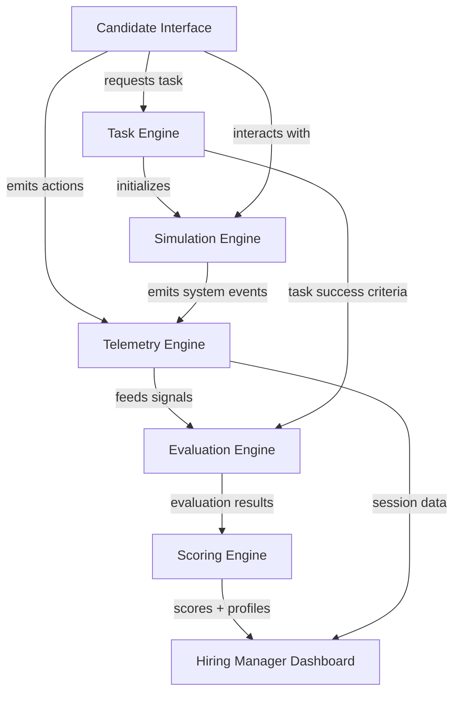
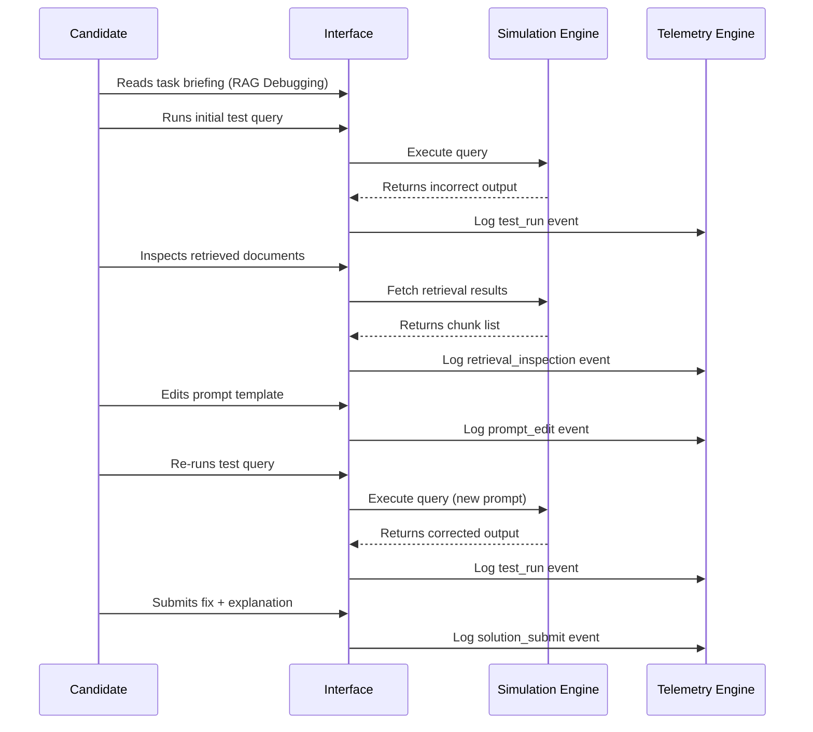
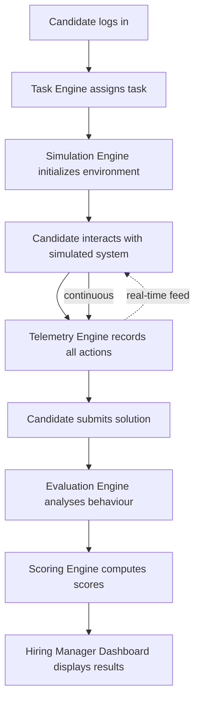

# System Architecture — AI Engineering Assessment Platform

> **Version:** 1.0 · **Status:** Draft · **Date:** March 2026
> **Reference:** [MVP_PRODUCT_SPEC.md](file:///c:/Users/shiva/Desktop/ai-assessment-platform/MVP_PRODUCT_SPEC.md)

---

## 1. System Architecture Overview

The AI Engineering Assessment Platform is composed of seven major subsystems, each with a clearly defined responsibility boundary. This separation ensures that measurement integrity, simulation fidelity, and scoring accuracy can be developed, tested, and scaled independently.

### Subsystem Map

| Subsystem | Responsibility |
|---|---|
| **Candidate Interface** | Web-based workspace where candidates complete assessments |
| **Task Engine** | Manages task lifecycle — loading, assignment, state, completion |
| **Simulation Engine** | Provides deterministic simulated AI environments |
| **Telemetry Engine** | Captures and stores all candidate behavioural signals |
| **Evaluation Engine** | Analyses telemetry and task outcomes to assess candidate behaviour |
| **Scoring Engine** | Computes weighted composite scores and capability profiles |
| **Hiring Manager Dashboard** | Presents results, scorecards, and session replay to hiring teams |

### Architecture Diagram



### Why This Separation Matters

A reliable measurement platform must guarantee that **what is measured** (Telemetry), **how it is judged** (Evaluation), and **what is presented** (Scoring/Dashboard) are independent, auditable layers. Coupling any of these would compromise the platform's ability to produce consistent, defensible hiring signals. This architecture allows each subsystem to be validated in isolation and extended without cascading changes.

---

## 2. Core System Components

### 2.1 Candidate Interface

#### Purpose

The Candidate Interface is the web-based environment where candidates interact with assessment tasks. It must feel like a **real AI engineering workspace** — not a quiz interface. Candidates should experience the assessment as realistic debugging work, using familiar tools and workflows.

#### UI Modules

| Module | Function |
|---|---|
| **Task Panel** | Displays task briefing, scenario context, objectives, and available tools |
| **Prompt Editor** | Code editor for modifying prompt templates, system instructions, and parameters |
| **Output Viewer** | Displays simulated model outputs, agent responses, and generation results |
| **Log Viewer** | Shows system logs, retrieval traces, reasoning steps, and error messages |
| **Submission Panel** | Allows candidates to submit their fix, explanation, or evaluation |

#### Example Candidate Workflow



Every action a candidate performs — from reading logs to editing prompts to running queries — is captured by the Telemetry Engine. The interface itself does not evaluate or score; it purely facilitates interaction and emits behavioural signals.

---

### 2.2 Task Engine

#### Purpose

The Task Engine manages the full lifecycle of assessment tasks: loading definitions, assigning tasks to candidates, initialising simulation environments, tracking task state, and validating completion.

#### Task Definition Structure

Every task is defined as a structured configuration containing the scenario, simulation parameters, available tools, and success criteria.

| Field | Type | Description |
|---|---|---|
| `task_id` | string | Unique identifier for the task |
| `capability_target` | string | Primary capability being measured |
| `simulation_type` | enum | `prompt_engine`, `rag_pipeline`, or `agent_workflow` |
| `problem_description` | text | Candidate-facing scenario description |
| `available_tools` | list | Tools the candidate can use during the task |
| `success_conditions` | list | Criteria defining task completion |
| `time_limit_minutes` | integer | Maximum time allowed for the task |

#### Sample Task Definition

```yaml
task_id: "rag-debug-001"
capability_target: "rag_debugging"
simulation_type: "rag_pipeline"
problem_description: |
  A customer support chatbot uses a document retrieval pipeline to answer
  product questions. Users report that the bot provides confident but
  incorrect answers, even though the correct information exists in the
  knowledge base. Diagnose and fix the issue.
available_tools:
  - prompt_editor
  - retrieval_viewer
  - test_query_runner
  - system_logs
success_conditions:
  - type: "output_match"
    query: "What is the return policy for electronics?"
    expected_contains: "30-day return window"
  - type: "root_cause_identified"
    expected_cause: "chunking_boundary_split"
time_limit_minutes: 20
```

#### Task Engine ↔ Simulation Engine Coordination

When a candidate begins a task, the Task Engine sends the task definition to the Simulation Engine, which initialises the appropriate environment (prompt engine, RAG pipeline, or agent workflow) with the configured failure mode, documents, and simulation parameters. The Task Engine then monitors task state and validates submissions against the defined success conditions.

---

### 2.3 Simulation Engine

The Simulation Engine is the core technical differentiator of the platform. It provides **deterministic, repeatable AI system simulations** that candidates interact with as if debugging a real production system.

For the MVP, the engine supports three simulation environments.

#### Prompt Engine Simulation

Simulates deterministic prompt-to-output behaviour. When a candidate modifies a prompt template, the simulation returns a predefined output based on pattern matching against the prompt content.

| Prompt Pattern | Simulated Output | Quality |
|---|---|---|
| Vague instructions, no examples | Inconsistent, partially hallucinated response | Poor |
| Clear instructions, no examples | Mostly correct but occasional drift | Medium |
| Clear instructions + few-shot examples | Consistent, correct response | Good |
| Clear instructions + examples + constraints | Precise, well-formatted response | Excellent |

Improvements are detected by matching the candidate's prompt against progressively better patterns. This allows the simulation to reward incremental prompt refinement.

#### RAG Pipeline Simulation

Simulates a simplified retrieval-augmented generation pipeline with four stages:

```
Query → Embedding Search → Chunk Retrieval → Prompt Injection → Generation
```

Candidates can inspect each stage:

| Component | What the Candidate Sees |
|---|---|
| `retrieved_chunks` | Document chunks returned by the retriever |
| `prompt_template` | Template used to inject context into the LLM prompt |
| `query` | The user's original question |
| `system_logs` | Retrieval scores, chunk IDs, and embedding distances |

**Example failure scenario:** Documents are chunked at paragraph boundaries, splitting a critical policy statement across two chunks. The retriever returns the first chunk (which lacks the key detail), leading to an incorrect answer. The candidate must identify the chunking boundary issue and adjust the retrieval or prompt configuration.

#### Agent Workflow Simulation

Simulates a multi-step AI agent that reasons, selects tools, and produces responses:

```
User Input → Agent Reasoning → Tool Selection → Tool Execution → Response
```

**Example failure modes:**

| Failure Mode | Symptom | Root Cause |
|---|---|---|
| Tool misuse | Agent calls wrong tool for the task | Ambiguous tool descriptions |
| Infinite loops | Agent repeats the same tool call | Missing termination condition |
| Incorrect reasoning | Agent reaches wrong conclusion | Flawed system prompt logic |

Candidates inspect reasoning traces, tool call logs, and tool schemas to diagnose and correct these issues.

---

## 3. Telemetry Engine

The Telemetry Engine is the core measurement layer. It records every meaningful candidate action with millisecond-precision timestamps, creating a complete behavioural log of each assessment session.

### Captured Signals

| Signal | Description |
|---|---|
| `prompt_edit` | Candidate modifies a prompt template or instruction |
| `test_run` | Candidate executes a query against the simulated system |
| `retrieval_inspection` | Candidate views retrieved chunks or retrieval results |
| `tool_usage` | Candidate invokes an available debugging tool |
| `reasoning_note` | Candidate writes an explanation or reasoning annotation |
| `solution_submit` | Candidate submits their final answer or fix |

### Telemetry Event Structure

Every event is stored with the following schema:

| Field | Type | Description |
|---|---|---|
| `timestamp` | ISO 8601 datetime | When the action occurred |
| `candidate_id` | UUID | Unique candidate identifier |
| `session_id` | UUID | Assessment session identifier |
| `task_id` | string | Active task identifier |
| `action_type` | enum | One of the signal types above |
| `action_payload` | JSON | Action-specific data |

### Example Telemetry Event

```json
{
  "timestamp": "2026-03-05T14:32:17.482Z",
  "candidate_id": "c-9f8e7d6c-5b4a-3210",
  "session_id": "s-1a2b3c4d-5e6f-7890",
  "task_id": "rag-debug-001",
  "action_type": "prompt_edit",
  "action_payload": {
    "field": "system_prompt",
    "previous_hash": "a1b2c3d4",
    "new_content": "You are a helpful support agent. Answer ONLY using the provided context documents. If the context does not contain the answer, say 'I don't have that information.'",
    "edit_number": 3
  }
}
```

Telemetry data feeds directly into the Evaluation Engine for behavioural analysis and is also used by the Hiring Manager Dashboard for session replay.

---

## 4. Evaluation Engine

The Evaluation Engine analyses telemetry data and task outcomes to produce structured assessments of candidate behaviour. For the MVP, evaluation is **rule-based** — a set of deterministic rules that map observed behaviours and outcomes to evaluation scores.

### Evaluation Dimensions

| Dimension | What is Assessed |
|---|---|
| Task Success | Did the candidate's submission resolve the problem? |
| Diagnostic Reasoning | Did they identify the correct root cause? |
| Iteration Strategy | Did they iterate systematically or guess randomly? |
| Tool Usage | Did they use available tools effectively? |

### Example Evaluation Rules

```
RULE: diagnostic_accuracy
  IF candidate.identifies("retrieval_failure")
  AND candidate.modifies("chunk_config" OR "retrieval_params")
  THEN diagnostic_score = HIGH

RULE: iteration_quality
  IF candidate.prompt_edit_count <= 5
  AND candidate.test_run_count >= 2
  AND task.success == TRUE
  THEN iteration_score = HIGH

RULE: tool_utilisation
  IF candidate.inspects("retrieval_results")
  AND candidate.inspects("system_logs")
  BEFORE candidate.edits("prompt")
  THEN tool_usage_score = HIGH
```

Evaluation rules are defined per task and can be tuned as the platform collects real-world assessment data. Future versions may supplement rule-based evaluation with ML-based behavioural analysis models.

---

## 5. Scoring Engine

The Scoring Engine transforms Evaluation Engine outputs into **composite scores and capability profiles** that hiring teams can act on.

### Scoring Dimensions and Weights

| Dimension | Weight | Signal Source |
|---|---|---|
| Task Success | 40% | Task outcome validation |
| Diagnostic Reasoning | 25% | Root-cause identification accuracy |
| Iteration Efficiency | 20% | Telemetry edit/run patterns |
| Tool Usage | 15% | Telemetry tool interaction patterns |

The final score is a **weighted composite** across all dimensions, normalised to a 0–100 scale.

### Capability Profiles

Beyond the composite score, the Scoring Engine produces a **per-capability profile** based on performance across tasks targeting different capabilities:

| Capability | Score |
|---|---|
| Prompt Engineering | 82 |
| RAG Debugging | 74 |
| Workflow Reasoning | 67 |
| Output Evaluation | 88 |
| Failure Diagnosis | 71 |

This profile allows hiring managers to see not just *how good* a candidate is overall, but *where* their strengths and gaps lie — enabling more informed hiring decisions and team composition planning.

---

## 6. Hiring Manager Dashboard

The Hiring Manager Dashboard is the web-based interface used by hiring teams to review candidate results.

### Dashboard Features

| Feature | Description |
|---|---|
| **Candidate Scorecard** | Composite score with per-dimension breakdown |
| **Capability Profile** | Visual representation of scores across capability areas |
| **Task Performance** | Detailed results for each task in the assessment |
| **Session Replay** | Chronological replay of candidate actions, edits, and debugging steps |
| **Candidate Comparison** | Side-by-side metric comparison of multiple candidates |

### Why Session Replay Matters

Session replay allows hiring managers to **observe how the candidate solved the problem step-by-step** — not just whether they solved it. This transforms the assessment from a black-box score into a transparent window into the candidate's engineering process. Managers can see whether the candidate approached problems systematically, used available tools, and reasoned through failures — providing far richer signal than a number alone.

---

## 7. Task Execution Flow

The complete lifecycle of an assessment session follows a strict pipeline that preserves measurement integrity at every stage.

### Flow Diagram



### Pipeline Integrity

Each stage in the pipeline has a single responsibility and a well-defined interface to the next stage:

1. **Task Engine** provides the task definition — it does not evaluate or score.
2. **Simulation Engine** produces deterministic responses — it does not capture telemetry.
3. **Telemetry Engine** records raw signals — it does not interpret them.
4. **Evaluation Engine** applies rules to telemetry — it does not assign scores.
5. **Scoring Engine** computes weighted scores — it does not display them.

This separation ensures that no single subsystem can introduce bias or inconsistency into the measurement pipeline.

---

## 8. Data Model

The MVP requires the following database tables to support the assessment lifecycle.

### Schema Overview

| Table | Purpose | Key Fields |
|---|---|---|
| `candidates` | Registered candidate profiles | `candidate_id`, `name`, `email`, `created_at` |
| `sessions` | Assessment sessions | `session_id`, `candidate_id`, `started_at`, `status`, `completed_at` |
| `tasks` | Task definitions | `task_id`, `capability_target`, `simulation_type`, `config_json` |
| `task_runs` | Individual task attempts within a session | `run_id`, `session_id`, `task_id`, `started_at`, `submitted_at`, `outcome` |
| `telemetry_events` | Candidate behavioural signals | `event_id`, `session_id`, `task_id`, `timestamp`, `event_type`, `payload` |
| `evaluation_results` | Per-task evaluation outputs | `result_id`, `run_id`, `dimension`, `score`, `evidence_json` |
| `scores` | Final computed scores | `score_id`, `session_id`, `composite_score`, `capability_profile_json` |

### Telemetry Events Schema

```sql
CREATE TABLE telemetry_events (
    event_id        UUID PRIMARY KEY,
    session_id      UUID NOT NULL REFERENCES sessions(session_id),
    task_id         VARCHAR(64) NOT NULL,
    timestamp       TIMESTAMPTZ NOT NULL,
    event_type      VARCHAR(32) NOT NULL,
    payload         JSONB NOT NULL,
    created_at      TIMESTAMPTZ DEFAULT NOW()
);

CREATE INDEX idx_telemetry_session ON telemetry_events(session_id);
CREATE INDEX idx_telemetry_task ON telemetry_events(task_id);
CREATE INDEX idx_telemetry_type ON telemetry_events(event_type);
```

---

## 9. Simulation Data Model

Each simulation environment is configured through a structured definition that specifies the system state, failure mode, documents, and expected solution.

### Simulation Configuration Structure

| Field | Type | Description |
|---|---|---|
| `simulation_id` | string | Unique identifier for the simulation configuration |
| `simulation_type` | enum | `prompt_engine`, `rag_pipeline`, or `agent_workflow` |
| `system_config` | JSON | Environment-specific configuration parameters |
| `documents` | list | Knowledge base documents (for RAG simulations) |
| `prompt_template` | text | Initial prompt template provided to the candidate |
| `failure_mode` | string | The injected failure the candidate must diagnose |
| `expected_solution` | string | The correct fix or diagnosis |
| `response_mappings` | JSON | Deterministic input→output mappings for the simulation |

### Example Simulation Configuration

```yaml
simulation_id: "rag-sim-001"
simulation_type: "rag_pipeline"
system_config:
  chunk_size: 200
  overlap: 0
  embedding_model: "simulated-v1"
  top_k: 3
documents:
  - id: "doc-001"
    title: "Return Policy"
    content: |
      Electronics purchased from our store can be returned within
      30 days of purchase. Items must be in original packaging.
      Refunds are processed within 5-7 business days.
  - id: "doc-002"
    title: "Shipping Policy"
    content: |
      Standard shipping takes 5-7 business days. Express shipping
      is available for an additional fee.
prompt_template: |
  Answer the user's question using the context below.
  Context: {retrieved_context}
  Question: {user_query}
failure_mode: "chunking_boundary_split"
expected_solution: "adjust_chunk_size"
response_mappings:
  default:
    output: "Our shipping takes 5-7 business days."
    quality: "incorrect"
  chunk_size_adjusted:
    output: "Electronics can be returned within 30 days of purchase in original packaging."
    quality: "correct"
```

### How Determinism Ensures Fairness

Every simulation configuration produces **identical behaviour for identical inputs**. There are no live LLM calls, no non-deterministic model inference, and no randomness in the simulation layer. This guarantees that:

- Two candidates performing the same actions see the same results
- Scores are comparable across assessment sessions
- Task difficulty is consistent and controllable
- Results are reproducible for audit and review purposes

---

## 10. Security & Integrity Layer

Assessment platforms are high-value targets for manipulation. Candidates or third parties may attempt to extract task content, automate answers, or replay previous sessions. The Security & Integrity Layer provides cross-cutting protections that span all subsystems.

### Threat Model

| Threat | Description |
|---|---|
| **Prompt leakage** | Task scenarios, simulation configs, or success criteria are extracted and shared publicly |
| **Task scraping** | Automated scripts harvest task content from the Candidate Interface |
| **Automated cheating** | Bots or external tools submit answers on behalf of the candidate |
| **Replay attacks** | A candidate reuses captured requests from a previous session to shortcut the assessment |

### Countermeasures

| Mechanism | Purpose |
|---|---|
| **Session token validation** | Every API request is authenticated against a short-lived, single-use session token bound to one candidate and one assessment. Tokens expire on submission or timeout. |
| **Task randomization** | Task parameters (document order, chunk IDs, variable names) are randomized per session so that memorized or shared answers do not transfer between candidates. |
| **Copy-paste monitoring** | The Telemetry Engine records clipboard events and large-text paste actions as signals. Unusual paste patterns (e.g., pasting a full solution without prior debugging steps) are flagged for review. |
| **Request rate limiting** | API endpoints enforce per-session rate limits to prevent automated scraping or brute-force query flooding against the Simulation Engine. |
| **Telemetry anomaly detection** | Behavioural heuristics flag sessions with anomalous patterns — such as impossibly fast task completion, zero debugging steps before a correct submission, or uniform timing between actions — for manual review. |
| **Encrypted task delivery** | Task definitions and simulation configurations are delivered over TLS and are never cached in plaintext on the client. The Candidate Interface fetches task content on-demand and does not pre-load future tasks. |

These mechanisms work together to ensure that assessment results reflect genuine candidate ability rather than leaked content or automated assistance.

---

*This document defines the internal architecture of the AI Engineering Assessment Platform. Engineers should reference this alongside [MVP_PRODUCT_SPEC.md](file:///c:/Users/shiva/Desktop/ai-assessment-platform/MVP_PRODUCT_SPEC.md) when beginning implementation planning.*
